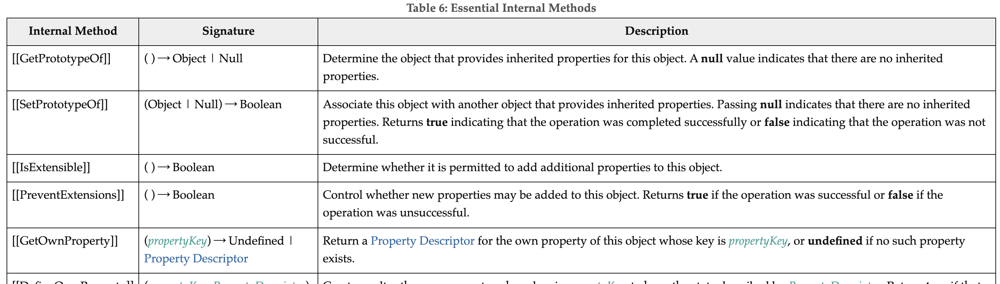

# 프로퍼티 어트리뷰트

## 내부 슬롯과 내부 메서드

js 엔진의 구현 알고리즘을 설명하기 위해 ECMAScript 사양에서 사용하는 의사 프로퍼티와 의사 메서드



ECMAScript 사양에 등장하는 이중 대괄호([[...]])로 감싼 이름들이 내부 슬롯과 내부 메서드다.

내부 슬롯과 내부 메서드는 ECMAScript 사양에 정의된 대로 구현되어 js 엔진에서 실제로 동작한다

개발자가 직접 접근할 수 있도록 외부로 공개된 객체의 프로퍼티는 아니다

내부 슬롯과 내부 메서드는 js 엔진의 내부 로직으로 원칙적으로 직접적으로 접근하거나 호출할 수 있는 방법을 제공하지 않는다

일부 내부 슬롯과 메서드에 한해 간접적으로 접근할 수 있는 수단을 제공하기는 한다

예를 들어, 모든 객체는 [[Prototype]]이라는 내부 슬롯을 갖는다

내부 슬롯은 js 내부 로직으로 원칙적으로 직접 접근할 수는 없지만 [[Prototype]] 내부 슬롯의 경우, ```__proto__```를 통해 간접적으로 접근할 수 있다

```js
const o = {};

o.[[Prototype]] // Uncaught SyntaxError: Unexpected token '['
o.__proto__ // -> Object.prototype
```

## 프로퍼티 어트리뷰트와 프로퍼티 디스크립터 객체

JS 엔진은 프로퍼티를 생성할 때 프로퍼티의 상태를 나타내는 프로퍼티 어트리뷰트를 기본값으로 자동 정의한다

프로퍼티의 상태란?

- 프로퍼티의 값
- 값의 갱신 가능 여부
- 열거 가능 여부
- 재정의 가능 여부

프로퍼티 어트리뷰트는 js 엔진이 관리하는 내부 상태 값인 내부 슬롯이다

프로퍼티 어트리뷰트

- [[Value]]
- [[Writable]]
- [[Enumerable]]
- [[Configurable]]

따라서 프로퍼티 어트리뷰트에 직접 접근할 수 없다

### Object.getOwnPropertyDescriptor

Object.getOwnPropertyDescriptor 메서드를 사용하여 간접적으로 확인할 수는 있다

```js
const person = {
  name: 'Lee'
};

// 프로퍼티 어트리뷰트 정보를 제공하는 프로퍼티 디스크립터 객체를 반환한다
console.log(Object.getOwnPropertyDescriptor(person, 'name'));
// {value: "Lee", writable: true, enumerable: true, configurable: true}
```

첫 번째 매개변수에는 객체의 참조를 전달한다

두 번째 매개변수에는 프로퍼티 키를 문자열로 전달한다

프로퍼티 디스크립터 객체를 반환한다

존재하지 않는 프로퍼티나 상속받은 프로퍼티에 대한 프로퍼티 디스크립터를 요구하면 undefined가 반환된다

Object.getOwnPropertyDescriptor 메서드는 하나의 프로퍼티에 대해 프로퍼티 디스크립터 객체를 반환하지만

Object.getOwnPropertyDescriptors 메서드는 모든 프로퍼티의 프로퍼티 어트리뷰트 정보르르 제공하는 프로퍼티 디스크립터 객체들을 반환한다

```js
const person = {
  name: 'Lee'
};

person.age = 20;

console.log(Object.getOwnPropertyDescriptors(person));
/*
{
  name: {value: "Lee", writable: true, enumerable: true, configurable: true},
  age: {value: 20, writable: true, enumerable: true, configurable: true}
}
*/
```

## 데이터 프로퍼티와 접근자 프로퍼티

### 데이터 프로퍼티

키와 값으로 구성된 일반적인 프로퍼티. 지금까지 살펴본 모든 프로퍼티는 데이터 프로퍼티다.

아래의 프로퍼티 어트리뷰트는 js 엔진이 프로퍼티를 생성할 때 기본값으로 자동 정의된다.

#### [[Value]]

- 프로퍼티 키를 통해 프로퍼티 값에 접근하면 반환되는 값
- 프로퍼티 키를 통해 프로퍼티 값을 변경하면 [[Value]]에 값을 재할당한다
- 이때 프로퍼티가 없으면 프로퍼티를 동적 생성하고 생성한 프로퍼티의 [[Value]]에 값을 저장한다

#### [[Writable]]

- 프로퍼티 값의 변경 가능 여부를 나타내며 불리언 값을 갖는다
- false인 경우 해당 프로퍼티의 [[Value]]의 값을 변경할 수 없는 읽기 전용 프로퍼티가 된다

#### [[Enumerable]]

- 프로퍼티 열거 가능 여부를 나타내며 불리언 값을 갖는다
- false인 경우 해당 프로퍼티는 ```for ... in``` 문이나 ```Object.keys``` 메서드 등으로 열거할 수 없다

#### [[Configurable]]

- 프로퍼티의 재정의 가능 여부를 나타내며 불리언 값을 갖는다
- false인 경우 해당 프로퍼티의 삭제, 값 변경이 금지된다
- true인 경우 [[Value]]의 변경과 [[Writable]]을 false로 변경을 할 수 있다

프로퍼티가 생성될 때 [[Value]]의 값은 프로퍼티 값으로 초기화되며 다른 프로퍼티 어트리뷰트의 값은 true로 초기화한다 (동적 추가도 마찬가지)

### 접근자 프로퍼티

자체적으로는 값을 갖지 않고 다른 데이터 프로퍼티의 값을 읽거나 저장할 때 호출되는 접근자 함수로 구성된 프로퍼티다.

```js
const person = {
  firstName: 'Ungmo',
  lastName: 'Lee',
  // getter 함수
  get fullName() {
    return `${this.firstName} ${this.lastName}`;
  },
  // setter 함수
  set fullName(name) {
    [this.firstName, this.lastName] = name.split(' ');
  }
};

console.log(Object.getOwnPropertyDescriptor(person, 'fullName'))
// {get: f, set: f, enumerable: true, configurable: true}
```

#### [[Get]]

- 접근자 프로퍼티를 통해 데이터 프로퍼티의 값을 읽을 때 호출되는 접근자 함수
- 접근자 프로퍼티 키로 프로퍼티 값에 접근하면 프로퍼티 어트리뷰트 [[Get]]의 값, 즉 getter 함수가 호출되고 그 결과가 프로퍼티 값으로 반환된다.

#### [[Set]]

- 접근자 프로퍼티를 통해 데이터 프로퍼티의 값을 저장할 때 호출되는 접근자 함수
- 접근자 프로퍼티 키로 프로퍼티 값을 저장하면 프로퍼티 어트리뷰트 [[Set]]의 값, 즉 setter 함수가 호출되고 그 결과가 프로퍼티 값으로 저장된다.

#### [[Enumerable]]

데이터 프로퍼티의 [[Enumerable]]과 같다

#### [[Configurable]]

데이터 프로퍼티의 [[Configurable]]과 같다

### 내부 슬롯/메서드 관점의 접근자 프로퍼티 값 접근 동작

1. 프로퍼티 키가 유효한지 확인한다. 프로퍼티 키는 문자열 또는 심벌이어야 한다
2. 프로토타입 체인에서 프로퍼티를 검색한다
3. 검색된 프로퍼티가 데이터 프로퍼티인지 접근자 프로퍼티인지 확인한다
4. 접근자 프로퍼티 일 시에는 접근자 함수를 호출하여 그 결과를 반환한다

### 접근자 프로퍼티 데이터 프로퍼티 구별

```js
// 일반 객체의 __proto__는 접근자 프로퍼티다
Object.getOwnPropertyDescriptor(Object.prototype, '__proto__');
// {get: f, set: f, enumerable: false, configurable: true}

// 함수 객체의 prototype은 데이터 프로퍼티다
Object.getOwnPropertyDescriptor(function(){}, 'prototype');
// {value: {...}, writable: true, emumerable: false, configurable: false}
```

접근자 프로퍼티와 데이터 프로퍼티의 프로퍼티 디스크립터 객체의 프로퍼티가 다르다

## 프로퍼티 정의

새로운 프로퍼티를 추가하면서 프로퍼티 어트리뷰트를 명시적으로 정의하거나, 기존 프로퍼티의 프로퍼티 어트리뷰트를 재정의 하는 것

이를 통해 객체의 프로퍼티가 어떻게 동작해야 하는지를 명확히 정의할 수 있다

### Object.defineProperty

프로퍼티의 어트리뷰트를 정의할 수 있다

인수로는 객체의 참조와 데이터 프로퍼티의 키인 문자열, 프로퍼티 디스크립터 객체를 전달한다

```js
const person = {};

Object.defineProperty(person, 'firstName', {
  value: 'Hyeongrok',
  writable: true,
  enumerable: true,
  configurable: true
});
```

Object.defineProperties 메서드로 여러 개의 프로퍼티를 한 번에 정의할 수 있다

```js
const person = {};

Object.defineProperties(person, {
  firstName:{
    // 프로퍼티 정의
  },
  lastName:{
    // 프로퍼티 정의
  },
  fullName:{
    get(){
      // getter
    },
    set(){
      // setter
    }
  }
})
```

### 프로퍼티 디스크립터 객체에서 생략된 어트리뷰트 기본 값

- value: undefined
- get: undefined
- set: undefined
- writable: false
- enumerable: false
- configurable: false

## 객체 변경 방지

객체는 변경 가능한 값으로 재할당 없이 직접 변경할 수 있다

### 객체 확장 금지 (Object.preventExtensions)

객체의 확장을 금지 한다 (프로퍼티 추가 금지)

확장이 금지된 객체는 프로퍼티 추가가 금지된다.

확장 가능 여부는 ```Object.isExtensible``` 메서드로 확인할 수 있다

```js
const person = {name: 'Lee'};

Object.preventExtensions(person);

console.log(Object.isExtensible(person)); // false
```

### 객체 밀봉 (Object.seal)

객체 밀봉은 프로퍼티 추가 및 삭제와 프로퍼티 어트리뷰트 재정의 금지를 의미한다

밀봉된 객체는 읽기와 쓰기만 가능하다

밀봉된 객체 여부는 ```Object.isSealed``` 메서드로 확인할 수 있다

```js
const person = {name: 'Lee'};

Object.seal(person);

console.log(Object.isSealed(person)); // true
```

### 객체 동결 (Object.freeze)

객체 동결은 프로퍼티 추가 및 삭제와 프로퍼티 어트리뷰트 재정의 금지, 프로퍼티 값 갱신 금지를 의미한다

동결된 객체는 읽기만 가능하다

동결된 객체 여부는 ```Object.isFrozen``` 메서드로 확인할 수 있다

```js
const person = {name: 'Lee'};

Object.freeze(person);

console.log(Object.isFrozen(person)) // true
```

### 불변 객체

위의 변경 방지 메서드들은 얕은 변경방지로 직속 프로퍼티만 변경이 방지되고 중첩 객체까지는 영향을 주지 못한다.

객체의 중첩 객체까지 동결하여 변경이 불가능한 읽기 전용의 불변 객체를 구현하려면 객체를 값으로 갖는 모든 프로퍼티에 대해 재귀적으로 ```Object.freeze``` 메서드를 호출해야한다

```js
const deepFreeze = (target) => {
  // 객체가 아니거나 동결된 객체는 무시하고 객체이고 동결되지 않은 객체만 동결한다
  if(target && typeof target === 'object' && !Object.isFrozen(target)){
    Object.freeze(target);
    /*
      모든 프로퍼티를 순회하며 재귀적으로 동결한다
      Object.keys 메서드는 객체 자신의 열거 가능한 프로퍼티 키를 배열로 반환한다
      forEach 메서드는 배열을 순회하며 배열의 각 요소에 대하여 콜백 함수를 실행한다
    */
    Object.keys(target).forEach(key => deepFreeze(target[key]));
  }
  return target;
}