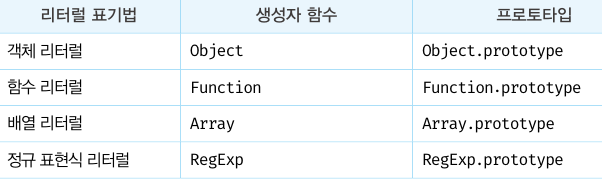

# 리터럴 표기법에 의해 생성된 객체의 생성자 함수와 프로토타입

리터럴 표기법에 의해 생성된 객체는 생성자 함수에 의해 생성된 객체는 아니나 큰 틀에서 생각해 보면 본질적인 면에서 큰 차이는 없다

프로토타입의 constructor 프로퍼티를 통해 연결되어 있는 생성자 함수를 리터럴 표기법으로 생성한 객체를 생성한 생성자 함수로 생각해도 크게 무리는 없다

```js
// 객체 리터럴
const obj = {};

// 함수 리터럴
const add = function (a, b) { return a + b; };

// 배열 리터럴
const arr = [1, 2, 3];

// 정규 표현식 리터럴
const regexp = /is/ig;
```

리터럴 표기법에 의해 생성된 객체도 물론 프로토타입이 존재한다

하지만 리터럴 표기법에 의해 생성된 객체의 경우 프로토타입의 constructor 프로퍼티가 가리키는 생성자 함수가 반드시 객체를 생성한 생성자 함수라고 단정할 수 없다

```js
// 객체 리터럴로 생성
const obj = {};

// 하지만 obj 객체의 생성자 함수는 Object 생성자 함수다.
console.log(obj.constructor === Object); // true
```

객체 리터럴이 평가될 때는 다음과 같이 추상 연산 OrdinaryObjectCreate를 호출하여 빈 객체를 생성하고 프로퍼티를 추가하도록 정의되어 있다

## Object 생성자 함수

- 인수를 전달하지 않거나 undefined 또는 null을 인수로 전달하면서 호출하면 내부적으로는 추상 연산 OrdinaryObjectCreate를 호출하여 Object.prototype을 프로토타입으로 갖는 빈 객체를 생성한다
- 인수가 전달된 경우에는 인수를 객체로 변환한다

### 추상 연산

ECMAScript 사양에서 내부 동작의 구현 알고리즘을 표현한 것

ECMAScript 사양에서 설명을 위해 사용하는 함수와 유사한 의사 코드라고 이해하자

## Object 생성자 함수 호출과 객체 리터럴 평가

추상 연산 OrdinaryObjectCreate를 호출하여 빈 객체를 생성하는 점에서 동일하나 new.target의 확인이나 프로퍼티를 추가하는 처리 등 세부 내용은 다르다

**객체 리터럴에 의해 생성된 객체는 Object 생성자 함수가 생성한 객체가 아니다**

## 함수 객체

Function 생성자 함수를 호출하여 생성한 함수는 렉시컬 스코프를 만들지 않고 전역 함수인 것처럼 스코프를 생성하며 클로저도 만들지 않는다

**따라서 함수 선언문과 함수 표현식을 평가하여 함수 객체를 생성한 것은 Function 생성자 함수가 아니다**

(하지만 constructor 프로퍼티를 통해 확인해보면 foo 함수의 생성자 함수는 Function 생성자 함수다)

```js
function foo(){}

console.log(foo.constructor === Function); // true
```

## 리터럴 표기법 프로토타입

리터럴 표기법에 의해 생성된 객체도 가상적인 생성자 함수를 갖는다

프로토타입은 생성자 함수와 더불어 생성되며 prototype, constructor 프로퍼터에 의해 연결되어 있기 때문이다.

**프로토타입과 생성자 함수는 단독으로 존재할 수 없고 언제나 쌍으로 존재한다.**

## 리터럴 표기법으로 생성된 객체의 생성자 함수와 프로토타입

