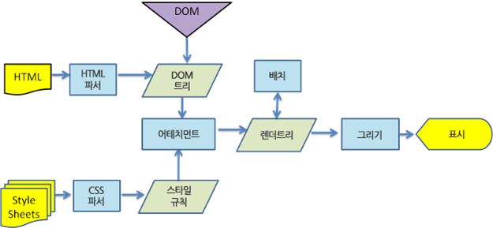

# Virtual DOM

DOM을 추상화한 가상의 객체

## DOM?

문서 객체 모델

브라우저에서 다룰 HTML 문서를 파싱하여 "문서의 구성요소들을 객체로 구조화하여 나타낸 것"

DOM은 HTML Elements, Attributes, CSS styles, Events, Methods 등을 제어할 수 있는 표준 인터페이스를 제공합니다.

웹 페이지를 구성하는 요소를 구조화해서 나타낸 객체고 이 객체를 이용해서 웹 페이지 구성요소를 제어할 수 있다

## 왜 Virtual DOM을 만들었는가

- DOM 조작에 의한 렌더링이 비효율적인 문제
- SPA(Single Page Application)특징으로 DOM 복잡도 증가에 따른 최적화 및 유지 보수가 더 어려워지는 문제

DOM을 반복적으로 직접 조작하면 그 만큼 브라우저가 렌더링을 자주하게 되고, 그 만큼 PC 자원을 많이 소모하게 된다

### 렌더링 과정

1. HTML을 파싱하여 DOM 객체를 생성하고, CSS를 파싱하여 스타일 규칙을 만든다
2. 이 두개를 합쳐서 실제로 웹 브라우저에 보여져야할 요소를 표현한 "렌더 트리" 라는 것을 만듭니다.
3. 이 렌더 트리를 기준으로 레이아웃을 배치하고 색을 칠하는 등의 작업을 합니다.

현대의 웹은 변경해야할 대상도 많고 변경도 많다

DOM을 여러번 조작하면 렌더링 또한 여러번 하게 된다

## 동작 원리

Virtual DOM이라는 DOM을 추상화한 가상의 객체를 메모리에 만들어 놓는다

Virtual DOM을 수정하고 Virtual DOM읉 통해 DOM을 수정하게 한다

Virtual DOM에 변경 내역을 한 번에 모으고(버퍼링) 실제 DOM과 변경된 Virtual DOM의 차이를 판단한 후, 구성요소의 변경이 부분만 찾아 변경하고 그에 따른 렌더링을 한 번만 한다

## 주의 사항 및 한계

- 동시에 변경되는 것에 한해서만 렌더링된다.
- React나 Vue를 사용하더라도 똑같이 최적화를 해야한다. (슬라이드를 옮기거나 무한 스크롤등의 움직임이 있을 때는 Virtual DOM을 이용해서 반복 렌더링을 하지 않도록 해줘야한다.)
- DOM에 준하는 무거운 객체(Virtual DOM)가 메모리에 존재하고 있기 때문에 메모리의 사용이 많이 늘어날 수 밖에 없다.
- Virtual DOM을 조작하는 것도 엄청나게 많은 컴포넌트를 조작하게 된다면 오버헤드가 생기기 마련이다. Virtual DOM 제어가 DOM 직접 제어에 비해 상대적으로 비용이 적게 들 뿐이다.