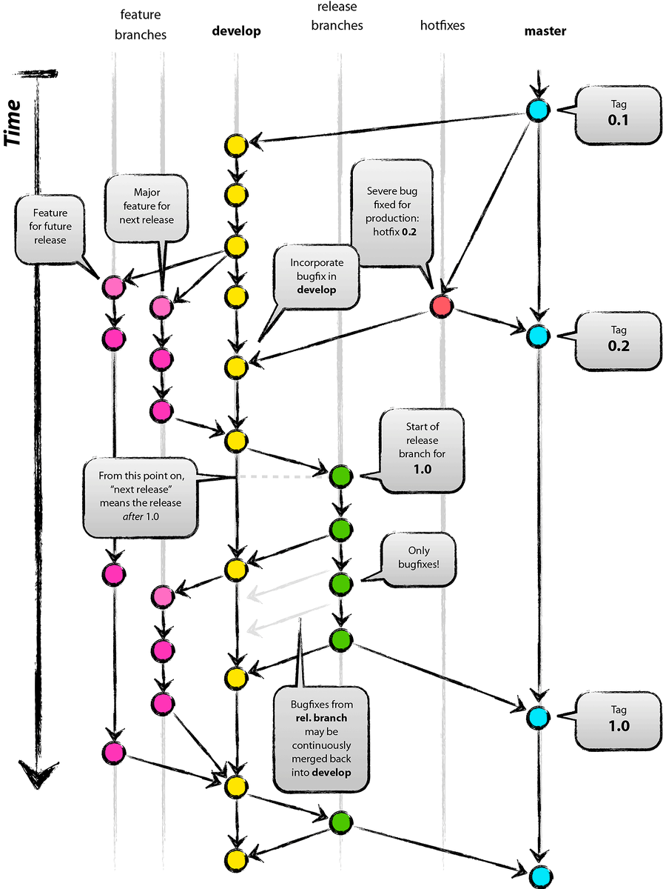

# Git flow

브랜치를 효율적으로 사용해보자!

## branchs

- master
- develop
- feature
- release
- hotfix

### master

정식 배포되는 안정적인 버전의 소스코드가 이 곳에서 관리된다.

master 브랜치의 HEAD는 소프트웨어의 최신 배포판의 소스코드 번전이 들어있다.

master 브랜치에는 지난 배포판 버전의 소스코드를 따라가기 위해 태그들이 추가되어 있다

이 태그로 각 릴리즈 버전의 소스코드를 빠르게 확인할 수 있다

master 브랜치에는 배포해도 될 만큼 안정성이 충분히 검증된 코드들만이 병합되어야 한다.

### develop

버그들을 수정하기 위한 코드와 새로운 기능을 추가하기 위한 코드, 성능을 개선하기 위한 코드들이 검증이 완료되고 PR 요청을 거치면 develop으로 merge된다

feature 브랜치에서 소스코드 수정을 한 다음 develop으로 PR 요청을 하게 된다.

리뷰어들이 기능들을 검토 후 develop으로 병합된다

feature 브랜치는 develop의 HEAD에서 생성된다

### feature

새로운 기능 개발이나 버그 수정을 위한 일련의 코드 수정이 이뤄지는 브랜치

이 브랜치에서 개발자 혼자 작업을 할 수 있고, 특정 기능 개발을 위한 여러명의 개발자들이 공동으로 작업할 수도 있다

feature 브랜치에서 작업된 내용은 최종적으로 PR을 거쳐 develop에 병합된다

### release

release를 위한 브랜치

develop 브랜치를 기반으로 생성된다

다음 release에 포함되어야 하는 기능셋과 버그 픽스들이 확정된 다음 생성된다

release 브랜치가 생성된 다음 QA테스트가 release 브랜치를 기반으로 진행된다

이 과정에서 발견된 버그 수정 사항들이 release와 develop 브랜치에 적용된다

release 브랜치의 코드들이 안정적으로 판단되면 master 브랜치에 병합되고 release에 해당하는 태그가 생성된다

release 브랜치가 생성된 후 반영된 수정사항들은 develop 브랜치에 반영된다

### hotfix

정기적인 release 이외에 긴급하게 수행되어야 하는 버그 수정을 위해 생성되는 브랜치이다

master를 기반으로 생성된다

hotfix에 긴급한 패치들이 반영된다

hotfix 브랜치는 master에 병합되고 태그생성이 된다

수정사항은 develop에도 반영된다

## flow

### common

feature -> develop -> release -> master

### hotfix

hotfix -> master